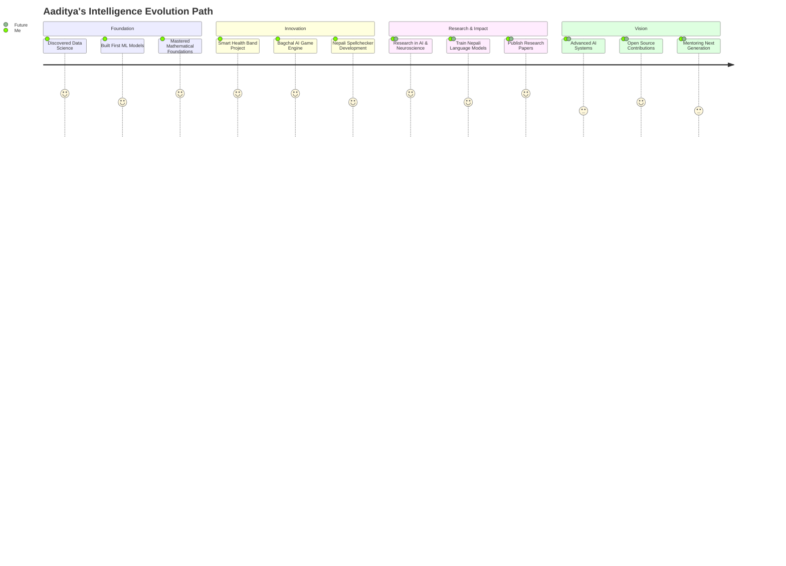

# <div align="center">✨ Aaditya Sapkota | Curious Builder of Intelligence ✨</div>

<div align="center">
  
</div>

<p align="center">
  
</p>

## 🧠 The Mind Behind the Code

> "I believe that every dataset tells a story, every algorithm solves a puzzle, and every model can change the world. My mission is to bridge the gap between mathematical elegance and real-world impact."

Hey Coders! 👋 I'm **Aaditya Sapkota**, an aspiring Data Scientist passionate about leveraging **Mathematics**, **Machine Learning**, and **Generative AI** to solve real-world problems. I approach every challenge with curiosity, creativity, and a drive to make a difference.

- **Curiosity** drives discovery
- **Mathematics** reveals truth  
- **Intelligence** amplifies human potential

My journey isn't just about building models—it's about creating intelligent solutions that make a meaningful difference in people's lives.

## 🔬 Current Research & Focus

- 🔭 **Working on:** Advanced data mining techniques and mathematical modeling for health analytics
- 🌱 **Deep diving into:** Machine Learning algorithms, GenAI architectures, and Nepali language processing
- 👯 **Collaborating on:** Open-source AI and Data Science projects that benefit the community
- 🤔 **Seeking:** Mentorship from ML/AI experts to accelerate my learning journey
- 💬 **Ask me about:** Data Science methodologies, Mathematical modeling, or event management strategies
- ⚡ **Fun fact:** I make data-driven decisions even when organizing competitions! 🎉

## ⚙️ Tech Arsenal & Intelligence Stack

<table>
  <tr>
    <td align="center" width="96">
      <a href="javascript:void(0)">
        
      </a>
      <br>Python
    </td>
    <td align="center" width="96">
      <a href="javascript:void(0)">
        
      </a>
      <br>TensorFlow
    </td>
    <td align="center" width="96">
      <a href="javascript:void(0)">
        
      </a>
      <br>PyTorch
    </td>
    <td align="center" width="96">
      <a href="javascript:void(0)">
        
      </a>
      <br>Pandas
    </td>
    <td align="center" width="96">
      <a href="javascript:void(0)">
        
      </a>
      <br>NumPy
    </td>
    <td align="center" width="96">
      <a href="javascript:void(0)">
        
      </a>
      <br>Scikit-learn
    </td>
  </tr>
  <tr>
    <td align="center" width="96">
      <a href="javascript:void(0)">
        
      </a>
      <br>Jupyter
    </td>
    <td align="center" width="96">
      <a href="javascript:void(0)">
        
      </a>
      <br>Firebase
    </td>
    <td align="center" width="96">
      <a href="javascript:void(0)">
        
      </a>
      <br>JavaScript
    </td>
    <td align="center" width="96">
      <a href="javascript:void(0)">
        
      </a>
      <br>Matplotlib
    </td>
    <td align="center" width="96">
      <a href="javascript:void(0)">
        
      </a>
      <br>OpenCV
    </td>
    <td align="center" width="96">
      <a href="javascript:void(0)">
        
      </a>
      <br>GitHub
    </td>
  </tr>
</table>

## 🧠 Developer Growth Journey



## 🚀 Intelligence Projects Observatory

<div align="center">

<table>
  <tr>
    <td width="50%">
      <h3 align="center">🏥 Smart Health Band Analytics</h3>
      <div align="center">  
        <a href="https://github.com/techaaditya/smart-health-band" target="_blank">
          
        </a>
        <br>
        <p>
          <a href="https://github.com/techaaditya/smart-health-band" target="_blank">
            
          </a>  
          <a href="#" target="_blank">
            
          </a>
        </p>
        <p>Real-time health monitoring with <strong>predictive analytics</strong> and personalized wellness recommendations.</p>
      </div>
    </td>
    <td width="50%">
      <h3 align="center">🎯 Bagchal AI Engine</h3>
      <div align="center">  
        <a href="https://github.com/techaaditya/bagchal-ai" target="_blank">
          
        </a>
        <br>
        <p>
          <a href="https://github.com/techaaditya/bagchal-ai" target="_blank">
            
          </a>  
          <a href="#" target="_blank">
            
          </a>
        </p>
        <p>Traditional Nepali game enhanced with <strong>intelligent AI opponent</strong> using minimax and neural networks.</p>
      </div>
    </td>
  </tr>
  <tr>
    <td width="50%">
      <h3 align="center">📝 Nepali Spellchecker Pro</h3>
      <div align="center">  
        <a href="https://github.com/techaaditya/nepali-spellchecker" target="_blank">
          
        </a>
        <br>
        <p>
          <a href="https://github.com/techaaditya/nepali-spellchecker" target="_blank">
            
          </a>  
          <a href="#" target="_blank">
            
          </a>
        </p>
        <p>Advanced NLP system for <strong>Nepali language processing</strong> with contextual error correction and suggestions.</p>
      </div>
    </td>
    <td width="50%">
      <h3 align="center">🎭 Nepali Poetic GPT</h3>
      <div align="center">  
        <a href="https://github.com/techaaditya/nepali-poetic-gpt" target="_blank">
          
        </a>
        <br>
        <p>
          <a href="https://github.com/techaaditya/nepali-poetic-gpt" target="_blank">
            
          </a>  
          <a href="#" target="_blank">
            
          </a>
        </p>
        <p><strong>Fine-tuned DistilGPT2</strong> on curated Nepali poems with rhythm analysis and metaphor understanding.</p>
      </div>
    </td>
  </tr>
</table>
</div>

## 📚 Knowledge Forest & Expertise Tree

```
Intelligence Architecture
│
├── Mathematical Foundation
│   ├── Linear Algebra & Calculus (★★★★★)
│   ├── Statistics & Probability (★★★★★)
│   └── Optimization Theory (★★★★☆)
│
├── Machine Learning Mastery  
│   ├── Supervised Learning (★★★★★)
│   ├── Unsupervised Learning (★★★★☆)
│   ├── Deep Learning & Neural Networks (★★★★☆)
│   └── Natural Language Processing (★★★★☆)
│
├── Generative AI & LLMs
│   ├── Transformer Architecture (★★★★☆)
│   ├── Fine-tuning Techniques (★★★★☆)
│   └── Prompt Engineering (★★★★★)
│
└── Applied Data Science
    ├── Data Mining & Analytics (★★★★★)
    ├── Feature Engineering (★★★★★) 
    ├── Model Deployment (★★★★☆)
    └── Research Methodology (★★★★☆)
```

## 🎯 Current Mission & Goals

<div align="center">

| 🎯 **Research Goals** | 📡 **Technical Goals** | 🧪 **Learning Goals** |
|:---:|:---:|:---:|
| Publish paper on Nepali Spellchecking | Deploy Health Band dashboard to Firebase | Start MS in AI + Neuroscience studies |
| Advance Nepali NLP research | Scale ML models to production | Master advanced deep learning |
| Contribute to open-source AI | Build real-time analytics systems | Explore quantum ML applications |

</div>


## 📈 Impact & Growth Metrics

<div align="center">
  
  
</div>

<div align="center">
  
</div>

## 💡 Code Nuggets & Intelligent Patterns

<details>
  <summary>🧠 Elegant Data Processing Pipeline</summary>
  
```python
def refine_dataset(df, target_column=None):
    """Transform raw data into intelligence-ready format."""
    return (df
            # Data quality assurance
            .pipe(lambda d: d[d['status'] == 'valid'])
            # Feature engineering with domain knowledge
            .assign(
                intelligence_score=lambda d: d['raw_score'] * 0.8 + d['context_bonus'],
                normalized_features=lambda d: StandardScaler().fit_transform(d.select_dtypes(include=[np.number]))
            )
            # Intelligent grouping and aggregation
            .groupby('category')
            .agg({
                'intelligence_score': ['mean', 'std', 'count'],
                'timestamp': ['min', 'max'],
                target_column or 'target': 'first'
            })
            # Statistical significance testing
            .pipe(lambda d: d[d[('intelligence_score', 'count')] >= 30])
            # Confidence interval calculation
            .assign(
                confidence_lower=lambda d: d[('intelligence_score', 'mean')] - 1.96 * d[('intelligence_score', 'std')],
                confidence_upper=lambda d: d[('intelligence_score', 'mean')] + 1.96 * d[('intelligence_score', 'std')]
            ))
```
</details>

<details>
  <summary>🤖 Smart Model Training Loop</summary>
  
```python
class IntelligentTrainer:
    """Advanced training pipeline with adaptive learning."""
    
    def __init__(self, model, optimizer, criterion):
        self.model = model
        self.optimizer = optimizer
        self.criterion = criterion
        self.best_score = float('-inf')
        self.patience_counter = 0
        
    async def train_epoch(self, dataloader, device):
        """Single epoch with intelligent monitoring."""
        self.model.train()
        total_loss = 0
        
        for batch_idx, (data, targets) in enumerate(dataloader):
            # Move to device
            data, targets = data.to(device), targets.to(device)
            
            # Forward pass with gradient accumulation
            self.optimizer.zero_grad()
            outputs = self.model(data)
            loss = self.criterion(outputs, targets)
            
            # Intelligent loss scaling
            loss = loss / self.gradient_accumulation_steps
            loss.backward()
            
            # Gradient clipping for stability
            torch.nn.utils.clip_grad_norm_(self.model.parameters(), max_norm=1.0)
            
            if (batch_idx + 1) % self.gradient_accumulation_steps == 0:
                self.optimizer.step()
                
            total_loss += loss.item()
            
        return total_loss / len(dataloader)
        
    def should_stop_early(self, validation_score):
        """Intelligent early stopping with patience."""
        if validation_score > self.best_score:
            self.best_score = validation_score
            self.patience_counter = 0
            return False
        else:
            self.patience_counter += 1
            return self.patience_counter >= self.patience_threshold
```
</details>

<details>
  <summary>🎭 Nepali Text Processing Magic</summary>
  
```python
def process_nepali_text(text: str) -> Dict[str, Any]:
    """Advanced Nepali text processing with linguistic awareness."""
    
    # Devanagari normalization and cleaning
    normalized_text = unicodedata.normalize('NFC', text)
    cleaned_text = re.sub(r'[^\u0900-\u097F\s]', '', normalized_text)
    
    # Intelligent tokenization respecting Nepali grammar
    tokens = nepali_tokenizer.tokenize(cleaned_text)
    
    # Morphological analysis
    morphological_features = []
    for token in tokens:
        features = {
            'word': token,
            'pos_tag': nepali_pos_tagger.tag(token),
            'root': extract_root_form(token),
            'inflection': analyze_inflection(token),
            'semantic_class': classify_semantic_category(token)
        }
        morphological_features.append(features)
    
    # Poetic meter analysis for creative applications
    meter_analysis = {
        'syllable_count': count_syllables(tokens),
        'stress_pattern': analyze_stress_pattern(tokens),
        'rhyme_scheme': detect_rhyme_scheme(tokens),
        'alliteration': find_alliteration(tokens)
    }
    
    return {
        'processed_text': cleaned_text,
        'morphological_features': morphological_features,
        'poetic_analysis': meter_analysis,
        'readability_score': calculate_nepali_readability(tokens),
        'sentiment_polarity': analyze_nepali_sentiment(tokens)
    }
```
</details>

## 🌱 Core Intelligence Pillars

<table>
  <tr>
    <td>
      <div align="center">
        
        <h3>🎯 Simplicity</h3>
        <p>Building elegant solutions that solve complex problems with mathematical precision</p>
      </div>
    </td>
    <td>
      <div align="center">
        
        <h3>🔐 Security</h3>
        <p>Protecting data privacy and ensuring ethical AI practices in every model</p>
      </div>
    </td>
    <td>
      <div align="center">
        
        <h3>🧬 Creativity</h3>
        <p>Innovating at the intersection of art, science, and intelligent systems</p>
      </div>
    </td>
  </tr>
</table>


🐍 Interactive GitHub Contribution Snake Animation
<div align="center">
  <picture>
    <source media="(prefers-color-scheme: dark)" srcset="https://raw.githubusercontent.com/techaaditya/TechAaditya/output/github-contribution-grid-snake-dark.svg">
    <source media="(prefers-color-scheme: light)" srcset="https://raw.githubusercontent.com/techaaditya/TechAaditya/output/github-contribution-grid-snake.svg">
    
  </picture>
</div>

## 📖 Data Science Philosophy

> "Every dataset whispers secrets about the world. My role is to listen carefully, ask the right questions, and translate those whispers into actionable intelligence."

> "The most powerful models are not the most complex ones, but those that capture the essence of truth with mathematical elegance and practical utility."

> "In the realm of artificial intelligence, we're not just building systems—we're expanding the boundaries of human understanding and capability."

> "Data science is the art of finding patterns in chaos, extracting meaning from noise, and building bridges between human intuition and machine precision."

## 🔗 Connect & Collaborate

<div align="center">
  <a href="https://linkedin.com/in/aadityasapkota">
    
  </a>
  <a href="mailto:aadityasapkota@gmail.com">
    
  </a>
  <a href="https://aadityasapkota.com.np">
    
  </a>
  <a href="https://twitter.com/aadityasapkota">
    
  </a>
  <a href="https://kaggle.com/aadityasapkota">
    
  </a>
</div>

---

<div align="center">
  
</div>

<div align="center">
  <h3>🚀 Let's build something amazing together! 🚀</h3>
  <p><em>Always learning, always growing, always curious about what intelligence can achieve.</em></p>
</div>

<div align="center">
  
</div>
